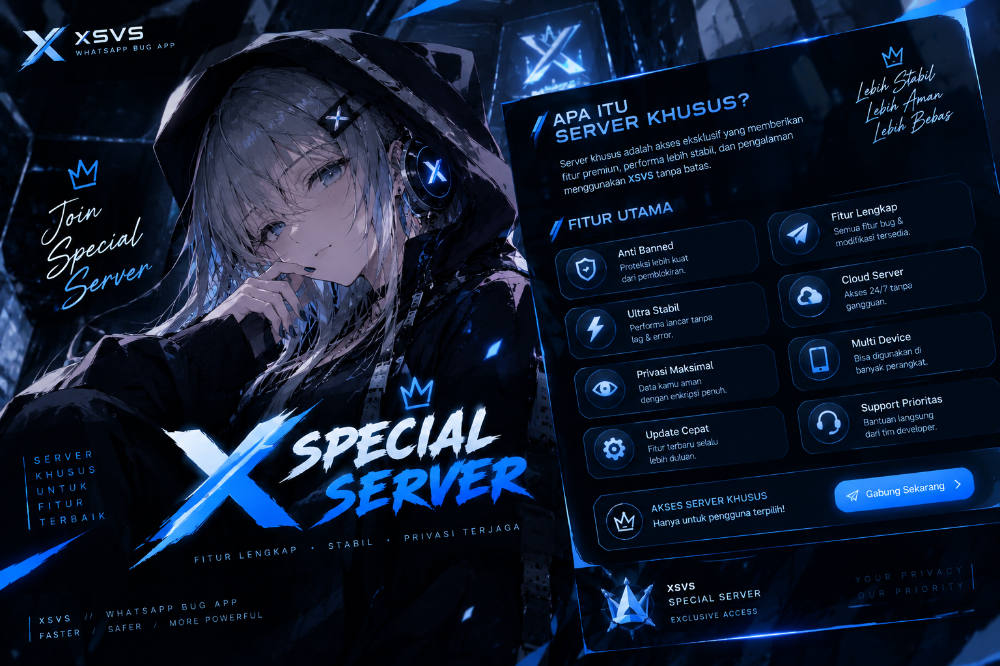
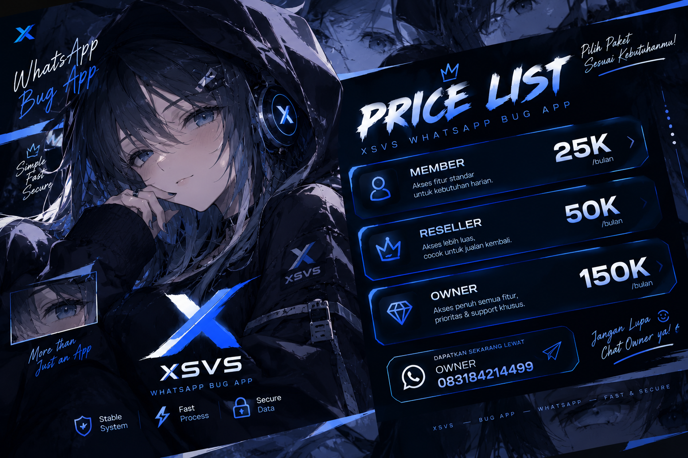
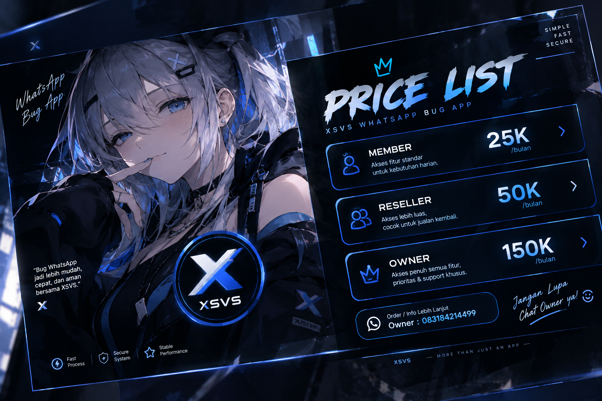
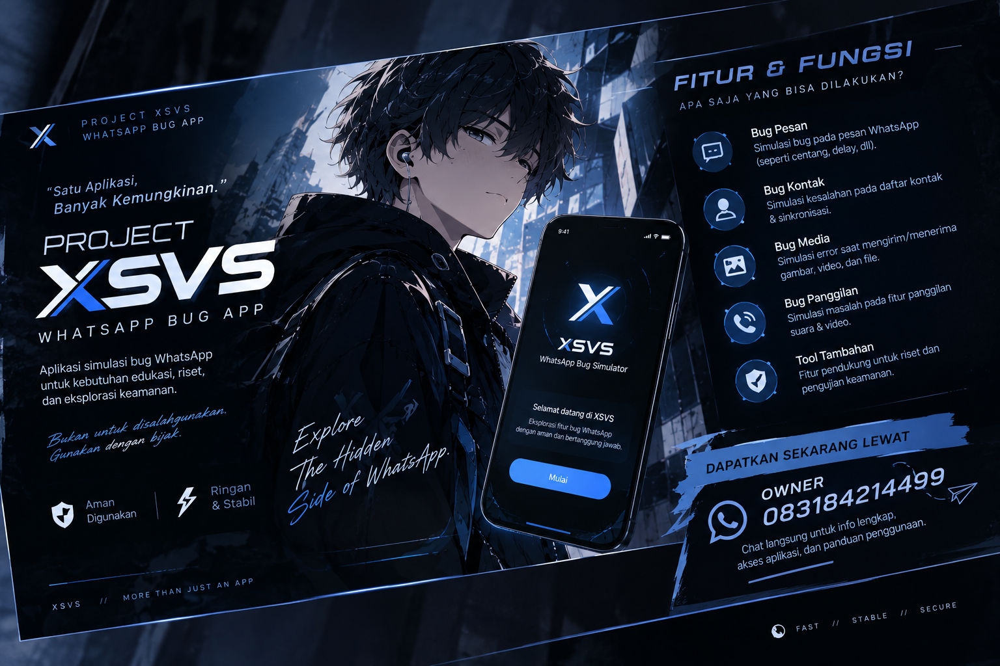
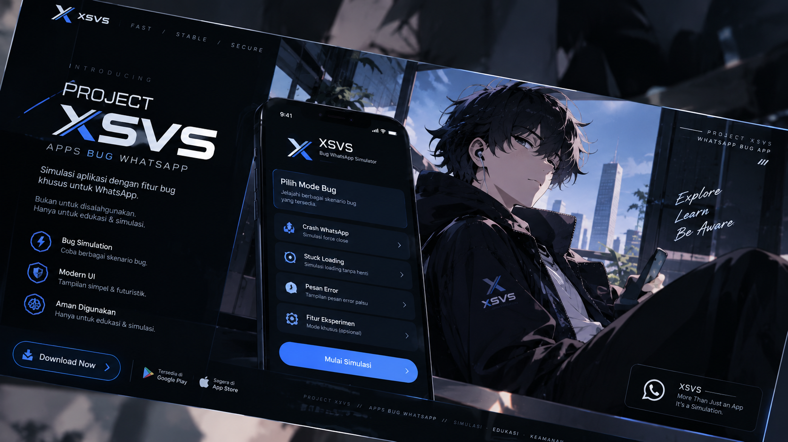

<!DOCTYPE html>
<html lang="id">
<head>
    <meta charset="UTF-8">
    <meta name="viewport" content="width=device-width, initial-scale=1.0, maximum-scale=1.0, user-scalable=no">
    <title>XSVS - PROMAX UI</title>
    
</head>
<body>

    

    
X

    
Notifikasi

    <!-- PAGE 1: ENTRY SCREEN (FIXED) -->
    

        

            TQ TO TEAM
            

                
                
                
            

        

        

            <video src="1video.mp4" autoplay loop muted playsinline onerror="this.style.display='none'"></video>
            
SXVS

        

        <button id="btn-enter" class="gow-text glass-panel" style="width: 250px; font-size: 20px;" onclick="triggerEntryShatter()">PRESS TO ENTER</button>

        

            

                <a href="https://tiktok.com/@kyz.n.e.m.e.s.i.s" target="_blank">
                    <svg viewBox="0 0 24 24"><path d="M19.59 6.69a4.83 4.83 0 0 1-3.77-4.25V2h-3.45v13.67a2.89 2.89 0 0 1-5.2 1.74 2.89 2.89 0 0 1 2.31-4.64 2.93 2.93 0 0 1 .88.13V9.4a6.84 6.84 0 0 0-1-.05A6.33 6.33 0 0 0 5 20.1a6.34 6.34 0 0 0 10.86-4.43v-7a8.16 8.16 0 0 0 4.77 1.52v-3.4a4.85 4.85 0 0 1-1-.1z"/></svg>
                </a>
                <a href="https://t.me/kyzz" target="_blank">
                    <svg viewBox="0 0 24 24"><path d="M12 2C6.48 2 2 6.48 2 12s4.48 10 10 10 10-4.48 10-10S17.52 2 12 2zm4.64 6.8c-.15 1.58-.8 5.42-1.13 7.19-.14.75-.42 1-.68 1.03-.58.05-1.02-.38-1.58-.75-.88-.58-1.38-.94-2.23-1.5-.99-.65-.35-1.01.22-1.59.15-.15 2.71-2.48 2.76-2.69.01-.03.01-.14-.07-.19-.08-.05-.19-.02-.27.01-.12.04-1.96 1.25-5.54 3.69-.52.36-1 .53-1.42.52-.47-.01-1.37-.26-2.03-.48-.82-.27-1.47-.42-1.42-.88.03-.24.29-.48.79-.74 3.08-1.34 5.15-2.23 6.19-2.66 2.95-1.23 3.56-1.44 3.97-1.45.09 0 .28.02.41.11.11.08.15.19.16.27-.01.04-.01.12-.02.16z"/></svg>
                </a>
                <a href="https://wa.me/6283184214499" target="_blank">
                    <svg viewBox="0 0 24 24"><path d="M17.472 14.382c-.297-.149-1.758-.867-2.03-.967-.273-.099-.471-.148-.67.15-.197.297-.767.966-.94 1.164-.173.199-.347.223-.644.075-.297-.15-1.255-.463-2.39-1.475-.883-.788-1.48-1.761-1.653-2.059-.173-.297-.018-.458.13-.606.134-.133.298-.347.446-.52.149-.174.198-.298.298-.497.099-.198.05-.371-.025-.52-.075-.149-.669-1.612-.916-2.207-.242-.579-.487-.5-.669-.51a12.8 12.8 0 0 0-.57-.01c-.198 0-.52.074-.792.372-.272.297-1.04 1.016-1.04 2.479 0 1.462 1.065 2.875 1.213 3.074.149.198 2.096 3.2 5.077 4.487.709.306 1.262.489 1.694.625.712.227 1.36.195 1.871.118.571-.085 1.758-.719 2.006-1.413.248-.694.248-1.289.173-1.413-.074-.124-.272-.198-.57-.347m-5.421 7.403h-.004a9.87 9.87 0 0 1-5.031-1.378l-.361-.214-3.741.982.998-3.648-.235-.374a9.86 9.86 0 0 1-1.51-5.26c.001-5.45 4.436-9.884 9.888-9.884 2.64 0 5.122 1.03 6.988 2.898a9.825 9.825 0 0 1 2.893 6.994c-.003 5.45-4.437 9.884-9.885 9.884m8.413-18.297A11.815 11.815 0 0 0 12.05 0C5.495 0 .16 5.335.157 11.892c0 2.096.547 4.142 1.588 5.945L.057 24l6.305-1.654a11.882 11.882 0 0 0 5.683 1.448h.005c6.554 0 11.89-5.335 11.893-11.893a11.821 11.821 0 0 0-3.48-8.413Z"/></svg>
                </a>
            

            XSVS
        

    

    <!-- PAGE 2: LOGIN SCREEN -->
    

        <video class="bg-video" src="webview.mp4" autoplay loop muted playsinline></video>
        

            
            
Silahkan masukan usn dan pw untuk login

            <input type="text" id="login-usn" placeholder="Username">
            <input type="password" id="login-pw" placeholder="Password">
            <button class="gow-text" style="width: 100%;" onclick="attemptLogin()">LOGIN</button>
        

    

    <!-- PAGE 3: LOADING SCREEN -->
    

        <video class="bg-video" src="2video.mp4" autoplay loop muted playsinline id="loading-video"></video>
        

            
INITIALIZING

            

                

            

        

    

    <!-- MAIN APP & TABS (FIXED BG DASHBOARD) -->
    

        
        <!-- DASHBOARD VIDEO BACKGROUND -->
        <video class="bg-video" src="bgvideo.mp4" autoplay loop muted playsinline style="opacity: 0.4;"></video>

        

            <!-- HEADER -->
            

                
XSVS

                
            

            <!-- TAB: DASHBOARD -->
            

                
                

                    

                        
                        
                        
                    

                    
XSVS APPS DENGAN TAMPILAN UI SUPER MODERN DAN FITUR YANG TERSEDIA BANYAK!

                

                
00:00:00

                

                    

                        
                        
                        
                        
                        
                    

                

                

                    
SELAMAT DATANG DI XSVS - SYSTEM ONLINE - ALL SYSTEMS NOMINAL - MAINTAINING CONNECTION...

                

            

            <!-- TAB: BUG WHATSAPP (FIXED HORIZONTAL SLIDER) -->
            

                

                    <video src="fvideo.mp4" autoplay loop muted playsinline></video>
                    <h2 class="zionix-text">XSVS</h2>
                

                

                    <input type="tel" id="target-number" placeholder="Target Number (ex: +628...)">
                

                

                    

                        SENDER PRIVAT

                    

                    

                        SENDER PUBLIC

                    

                

                <!-- MENU SLIDER HORIZONTAL -->
                

                    
DELAY HARD

                    
BLANK OS

                    
BLANK ANDRO

                    
CRASH BULDOZER

                    
FC BLANK

                    
CRASH ANDRO

                    
DELAY MS

                

                <button class="gow-text" style="width: 100%;" onclick="executeBug()">EXECUTE</button>
            

            <!-- TAB: TOOLS -->
            

                <h3 class="gow-text" style="margin-bottom: 20px; text-align: center;">TOOLS MODULE</h3>
                

                    

                        <svg viewBox="0 0 24 24"><path d="M20 4H4c-1.1 0-1.99.9-1.99 2L2 18c0 1.1.9 2 2 2h16c1.1 0 2-.9 2-2V6c0-1.1-.9-2-2-2zm0 4l-8 5-8-5V6l8 5 8-5v2z"/></svg>
                        Spam NGL
                    

                    

                        <svg viewBox="0 0 24 24"><path d="M15.5 14h-.79l-.28-.27A6.471 6.471 0 0 0 16 9.5 6.5 6.5 0 1 0 9.5 16c1.61 0 3.09-.59 4.23-1.57l.27.28v.79l5 4.99L20.49 19l-4.99-5zm-6 0C7.01 14 5 11.99 5 9.5S7.01 5 9.5 5 14 7.01 14 9.5 11.99 14 9.5 14z"/></svg>
                        Search OSINT
                    

                    

                        <svg viewBox="0 0 24 24"><path d="M14 2H6c-1.1 0-1.99.9-1.99 2L4 20c0 1.1.89 2 1.99 2H18c1.1 0 2-.9 2-2V8l-6-6zm2 16H8v-2h8v2zm0-4H8v-2h8v2zm-3-5V3.5L18.5 9H13z"/></svg>
                        NIK to Phone
                    

                    

                        <svg viewBox="0 0 24 24"><path d="M20.01 15.38c-1.23 0-2.42-.2-3.53-.56a.977.977 0 0 0-1.01.24l-1.57 1.97c-2.83-1.35-5.48-3.9-6.89-6.83l1.95-1.66c.27-.28.35-.67.24-1.02-.37-1.11-.56-2.3-.56-3.53 0-.54-.45-.99-.99-.99H4.19C3.65 3 3 3.24 3 3.99 3 13.28 10.73 21 20.01 21c.71 0 .99-.63.99-1.18v-3.45c0-.54-.45-.99-.99-.99z"/></svg>
                        Phone to NIK
                    

                    

                        <svg viewBox="0 0 24 24"><path d="M19 9h-4V3H9v6H5l7 7 7-7zM5 18v2h14v-2H5z"/></svg>
                        Downloader
                    

                    

                        <svg viewBox="0 0 24 24"><path d="M19.35 10.04C18.67 6.59 15.64 4 12 4 9.11 4 6.6 5.64 5.35 8.04 2.34 8.36 0 10.91 0 14c0 3.31 2.69 6 6 6h13c2.76 0 5-2.24 5-5 0-2.64-2.05-4.78-4.65-4.96zM14 13v4h-4v-4H7l5-5 5 5h-3z"/></svg>
                        Img to URL
                    

                    

                        <svg viewBox="0 0 24 24"><path d="M17.71 7.71L12 2h-1v7.59L6.41 5 5 6.41 10.59 12 5 17.59 6.41 19 11 14.41V22h1l5.71-5.71-4.3-4.29 4.3-4.29zM13 5.83l1.88 1.88L13 9.59V5.83zm1.88 10.46L13 18.17v-3.76l1.88 1.88z"/></svg>
                        BLE Spam
                    

                

            

            <!-- TAB: PROFILE -->
            

                

                    

                        <input type="file" id="profile-input" accept="image/*" onchange="previewProfile(this)">
                        TAP TO UPLOAD
                        
                    

                    

                        <input type="text" id="prof-name" placeholder="Name" style="margin-bottom: 10px;">
                        <input type="text" id="prof-id" placeholder="User ID" style="margin-bottom: 20px;">
                        <button class="gow-text" style="width: 100%;" onclick="saveProfile()">SAVE PROFILE</button>
                    

                

            

            <!-- BOTTOM NAV -->
            <nav class="bottom-nav glass-panel">
                

                    <svg viewBox="0 0 24 24"><path d="M3 13h8V3H3v10zm0 8h8v-6H3v6zm10 0h8V11h-8v10zm0-18v6h8V3h-8z"/></svg>
                    DASHBOARD
                

                

                    <svg viewBox="0 0 24 24"><path d="M20 8h-2.81c-.45-.78-1.07-1.45-1.82-1.96L17 4.41 15.59 3l-2.17 2.17C12.96 5.06 12.49 5 12 5c-.49 0-.96.06-1.41.17L8.41 3 7 4.41l1.62 1.63C7.88 6.55 7.26 7.22 6.81 8H4v2h2.09c-.05.33-.09.66-.09 1v1H4v2h2v1c0 .34.04.67.09 1H4v2h2.81c1.04 1.79 2.97 3 5.19 3s4.15-1.21 5.19-3H20v-2h-2.09c.05-.33.09-.66.09-1v-1h2v-2h-2v-1c0-.34-.04-.67-.09-1H20V8zm-6 8h-4v-2h4v2zm0-4h-4v-2h4v2z"/></svg>
                    BUG WA
                

                

                    <svg viewBox="0 0 24 24"><path d="M22.7 19l-9.1-9.1c.9-2.3.4-5-1.5-6.9-2-2-5-2.4-7.4-1.3L9 6 6 9 1.6 4.7C.5 7.1.9 10.1 2.9 12.1c1.9 1.9 4.6 2.4 6.9 1.5l9.1 9.1c.4.4 1 .4 1.4 0l2.3-2.3c.5-.4.5-1.1.1-1.4z"/></svg>
                    TOOLS
                

                

                    <svg viewBox="0 0 24 24"><path d="M12 12c2.21 0 4-1.79 4-4s-1.79-4-4-4-4 1.79-4 4 1.79 4 4 4zm0 2c-2.67 0-8 1.34-8 4v2h16v-2c0-2.66-5.33-4-8-4z"/></svg>
                    PROFILE
                

            </nav>

            

                <svg viewBox="0 0 24 24" width="24" height="24" fill="white"><path d="M3.9 12c0-1.71 1.39-3.1 3.1-3.1h4V7H7c-2.76 0-5 2.24-5 5s2.24 5 5 5h4v-1.9H7c-1.71 0-3.1-1.39-3.1-3.1zM8 13h8v-2H8v2zm9-6h-4v1.9h4c1.71 0 3.1 1.39 3.1 3.1s-1.39 3.1-3.1 3.1h-4V17h4c2.76 0 5-2.24 5-5s-2.24-5-5-5z"/></svg>
            

        

    

    <!-- MODAL: LINK DEVICE -->
    

        

            
&times;

            <h3 class="gow-text" style="font-size: 16px; text-align: center;">TAUTKAN PERANGKAT</h3>
            <input type="tel" id="link-phone" placeholder="No. WA (+62...)">
            <button class="gow-text" onclick="showToast('Menghubungkan ke Perangkat...', true); setTimeout(()=>{document.getElementById('modal-link').classList.remove('active'); showToast('Perangkat Ditautkan!');}, 2000);">LINK DEVICE</button>
        

    

    <!-- MODAL: TOOLS -->
    

        

            
&times;

            <h3 class="gow-text" id="tool-title" style="font-size: 16px; text-align: center;">TOOL</h3>
            <input type="text" id="tool-input" placeholder="Input">
            <button class="gow-text" onclick="executeTool()">EXECUTE</button>
        

    

    <!-- JAVASCRIPT -->
    
</body>
</html>
